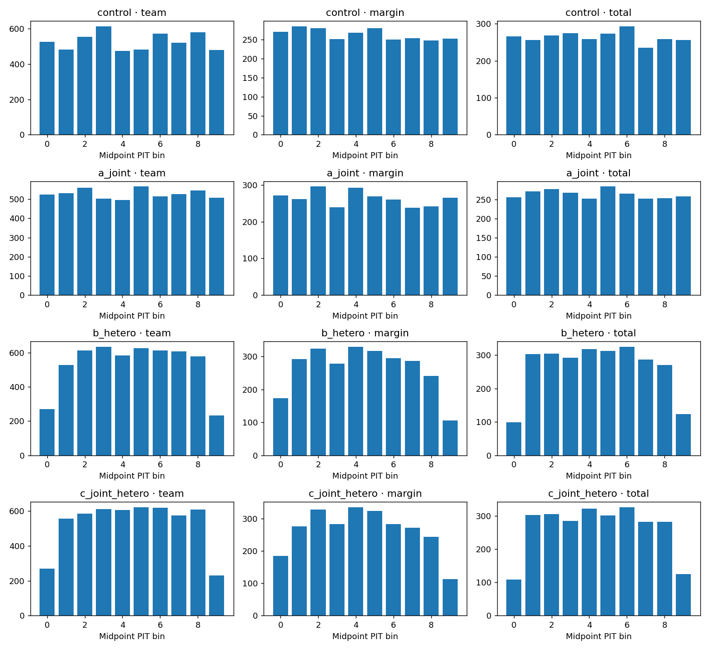
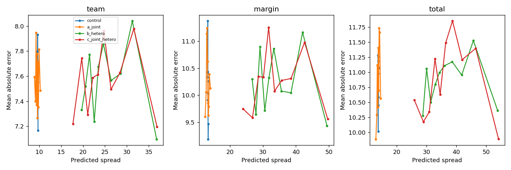
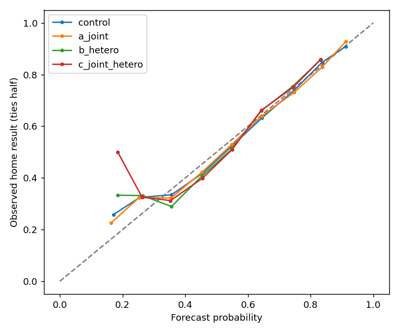

# E-UNC review packet

REVIEW REQUESTED: empirical paired ensemble rather than Gaussian copula; log-absolute-error scale rather than log variance; conditional ridge sandwich rather than full-pipeline bootstrap; interval-score non-worsening tested per target. Details: GAP-SWEEP.md.

## Decision
RETAIN CONTROL. No challenger passes. Candidate b and c are PARTIAL TESTS; rejection applies only to the reduced feature set. The richer heteroscedastic question returns after inactive histories qualify. Primary objective reverts to team MAE for the next experiment.

Secondary wind analysis is NOT RUN: no stored wind history proves pre-issuance timing; 2021 is outside the documented archive. This is an explicit unfinished data-dependent requirement, not a null wind result. See secondary.json.

## Audit before model changes
50/80 bands are predictive empirical residual quantiles for a single game, not confidence intervals for a fitted mean. engine/projection/distribution.py::residual_distribution, pmf, quantile, summarize rounds residuals and centers for discrete PMFs. engine/board_v7.py::metadata builds team bands from the issuing version’s pooled team residual PMF; scripts/projection_v3_publish.py::shape_for pins that fit.
Margin and total residuals are formed from home/away errors of the SAME GAME in engine/projection_v2/qualify.py::residuals; summarize uses those PMFs directly. No independent combination defect was found. Winner probability is positive-margin mass plus half tie mass. This semantics is retained and labeled.
Pooled incumbent adaptive OOF correlation (2639 games) = 0.049931. This retrospective number is diagnostic, never inserted into earlier fits. Evaluation uses retained E1 linear point forecasts and fold-specific training dependence.
The old artifact contains no separately identified parameter/noise components. variance.json adds a conditional training-only game-cluster sandwich estimate for the retained ridge. Its residual component includes misspecification and is NOT a measured physical irreducible floor. Pointwise predictive variance is estimated parameter variance plus that residual estimate.

## Gate
|Candidate|Team CRPS improvement|Paired 95% interval|Coverage|Winkler|Point invariance|Pass|
|---|---:|---|---|---|---|---|
|a_joint|0.1519%|-0.0920% to 0.4075%|True|False|True|False|
|b_hetero|-5.3410%|-5.9167% to -4.6001%|False|False|True|False|
|c_joint_hetero|-5.5661%|-6.2206% to -4.7719%|False|False|True|False|

All 2639 games paired; max point change 0. No candidate refits point forecasts. 500 members for joint candidates; no candidate promotion; no frozen artifact rewritten.

## Full season scores
Coverage and width shown together; counts are observations (team rows = twice games). Scores are unrounded internally.
|Season|Candidate|Target|N|MAE|CRPS|50 hits|50 coverage|50 width|50 Winkler|80 hits|80 coverage|80 width|80 Winkler|
|---|---|---|---:|---:|---:|---:|---:|---:|---:|---:|---:|---:|---:|
|pooled|control|team|5278|7.571625|5.359013|2882|0.5460|13.0000|24.1269|4318|0.8181|24.7821|33.6112|
|pooled|control|margin|2639|10.246167|7.334711|1380|0.5229|16.0000|33.1110|2136|0.8094|33.1088|47.3907|
|pooled|control|total|2639|10.874909|7.678662|1388|0.5260|18.0970|34.5532|2177|0.8249|35.8969|48.0417|
|pooled|a_joint|team|5278|7.571625|5.350874|2626|0.4975|12.5992|24.1113|4246|0.8045|24.8058|33.5073|
|pooled|a_joint|margin|2639|10.246167|7.335213|1336|0.5063|16.0419|33.1467|2101|0.7961|33.3566|47.4438|
|pooled|a_joint|total|2639|10.874909|7.699221|1339|0.5074|18.3771|34.6245|2125|0.8052|35.5586|48.4013|
|pooled|b_hetero|team|5278|7.571625|5.645239|3055|0.5788|15.1124|24.4342|4775|0.9047|34.9050|38.4398|
|pooled|b_hetero|margin|2639|10.246167|7.756700|1536|0.5820|19.8995|33.7749|2361|0.8947|48.6984|55.2186|
|pooled|b_hetero|total|2639|10.874909|8.108095|1546|0.5858|22.0449|35.1593|2416|0.9155|50.2730|55.4563|
|pooled|c_joint_hetero|team|5278|7.571625|5.657299|3066|0.5809|15.1447|24.4729|4779|0.9055|35.5053|39.2413|
|pooled|c_joint_hetero|margin|2639|10.246167|7.776368|1529|0.5794|19.8397|33.8240|2342|0.8875|48.7401|55.4816|
|pooled|c_joint_hetero|total|2639|10.874909|8.141199|1538|0.5828|21.9838|35.2425|2406|0.9117|50.3804|55.7217|
|2016|control|team|512|7.148363|5.095491|283|0.5527|13.0000|22.9688|434|0.8477|25.0000|31.7969|
|2016|control|margin|256|9.444350|6.672019|144|0.5625|17.0000|30.1875|220|0.8594|33.0000|42.6484|
|2016|control|total|256|10.408030|7.436206|146|0.5703|19.0000|33.3750|218|0.8516|36.0000|46.9375|
|2016|a_joint|team|512|7.148363|5.037620|263|0.5137|12.5137|22.6681|429|0.8379|25.1617|31.5227|
|2016|a_joint|margin|256|9.444350|6.685108|139|0.5430|16.1605|30.1663|216|0.8438|33.9363|43.1051|
|2016|a_joint|total|256|10.408030|7.453056|139|0.5430|18.8458|33.4006|209|0.8164|35.8312|47.7783|
|2016|b_hetero|team|512|7.148363|6.217996|374|0.7305|19.6136|24.6633|512|1.0000|60.7493|60.7493|
|2016|b_hetero|margin|256|9.444350|8.354140|182|0.7109|26.2610|33.3090|253|0.9883|86.7013|87.0708|
|2016|b_hetero|total|256|10.408030|9.105833|193|0.7539|29.5785|36.7690|256|1.0000|91.8921|91.8921|
|2016|c_joint_hetero|team|512|7.148363|6.222373|369|0.7207|19.5159|24.6542|509|0.9941|63.8933|64.0639|
|2016|c_joint_hetero|margin|256|9.444350|8.401166|186|0.7266|26.0638|33.4581|254|0.9922|85.5322|86.0544|
|2016|c_joint_hetero|total|256|10.408030|9.140257|191|0.7461|29.2854|36.8039|254|0.9922|90.7751|91.0155|
|2017|control|team|512|7.799615|5.577853|277|0.5410|13.0000|25.1094|407|0.7949|25.0000|35.8398|
|2017|control|margin|256|10.909361|7.698412|131|0.5117|16.0000|34.8438|202|0.7891|32.0000|49.7734|
|2017|control|total|256|11.229071|7.944502|133|0.5195|18.0000|35.6250|202|0.7891|36.0000|50.3750|
|2017|a_joint|team|512|7.799615|5.534740|250|0.4883|12.5031|24.9713|401|0.7832|24.7156|35.6708|
|2017|a_joint|margin|256|10.909361|7.703419|127|0.4961|15.8643|34.9932|200|0.7812|32.8758|49.3474|
|2017|a_joint|total|256|11.229071|7.960370|129|0.5039|18.4288|35.7465|197|0.7695|35.3147|50.6316|
|2017|b_hetero|team|512|7.799615|6.076922|305|0.5957|16.1887|25.5257|488|0.9531|40.7919|42.7760|
|2017|b_hetero|margin|256|10.909361|8.415019|156|0.6094|21.9731|35.5228|235|0.9180|59.0292|63.8899|
|2017|b_hetero|total|256|11.229071|8.701864|163|0.6367|24.4939|36.6427|246|0.9609|57.6975|60.2230|
|2017|c_joint_hetero|team|512|7.799615|6.078796|320|0.6250|16.3395|25.5161|484|0.9453|43.8995|45.8587|
|2017|c_joint_hetero|margin|256|10.909361|8.435494|153|0.5977|21.7817|35.6932|237|0.9258|60.6343|64.8419|
|2017|c_joint_hetero|total|256|11.229071|8.750475|162|0.6328|24.3186|36.7689|245|0.9570|60.3966|62.7988|
|2018|control|team|512|7.870248|5.624851|276|0.5391|13.0000|25.3828|407|0.7949|25.0000|35.8008|
|2018|control|margin|256|10.514189|7.492511|128|0.5000|15.0000|33.6719|206|0.8047|33.0000|49.4453|
|2018|control|total|256|11.218112|8.035797|141|0.5508|18.0000|36.0781|208|0.8125|36.0000|52.5625|
|2018|a_joint|team|512|7.870248|5.599389|251|0.4902|12.5095|25.2986|397|0.7754|24.7902|35.3266|
|2018|a_joint|margin|256|10.514189|7.526341|128|0.5000|15.8942|33.8872|204|0.7969|33.0520|49.7251|
|2018|a_joint|total|256|11.218112|8.044169|138|0.5391|18.4283|36.0158|207|0.8086|35.6560|52.9938|
|2018|b_hetero|team|512|7.870248|5.932600|297|0.5801|15.4409|25.5452|472|0.9219|36.0996|38.7648|
|2018|b_hetero|margin|256|10.514189|7.992252|159|0.6211|20.7878|34.5176|241|0.9414|51.7343|56.7354|
|2018|b_hetero|total|256|11.218112|8.524696|159|0.6211|22.6921|36.7459|234|0.9141|51.7844|57.2669|
|2018|c_joint_hetero|team|512|7.870248|5.932537|292|0.5703|15.5268|25.3793|476|0.9297|36.8065|39.9635|
|2018|c_joint_hetero|margin|256|10.514189|7.979896|161|0.6289|20.7330|34.3215|238|0.9297|51.6124|56.4159|
|2018|c_joint_hetero|total|256|11.218112|8.592760|155|0.6055|22.4979|37.1934|231|0.9023|51.5706|57.5089|
|2019|control|team|512|7.520414|5.364335|281|0.5488|13.0000|24.2344|425|0.8301|26.0000|34.1055|
|2019|control|margin|256|10.230927|7.578006|134|0.5234|16.0000|34.2812|203|0.7930|33.0000|48.0000|
|2019|control|total|256|11.044970|7.759363|133|0.5195|18.0000|34.9531|212|0.8281|36.0000|47.2891|
|2019|a_joint|team|512|7.520414|5.426462|254|0.4961|12.5812|24.5242|406|0.7930|24.8532|34.2898|
|2019|a_joint|margin|256|10.230927|7.554879|127|0.4961|15.9372|34.3638|197|0.7695|33.0384|48.2176|
|2019|a_joint|total|256|11.044970|7.776092|125|0.4883|18.1779|35.0050|203|0.7930|35.7423|47.7633|
|2019|b_hetero|team|512|7.520414|5.631581|300|0.5859|15.0347|24.5018|466|0.9102|33.9678|37.0619|
|2019|b_hetero|margin|256|10.230927|7.987517|138|0.5391|19.7476|35.2053|227|0.8867|46.5411|53.6256|
|2019|b_hetero|total|256|11.044970|8.146924|142|0.5547|21.4662|35.1508|240|0.9375|48.0717|52.3033|
|2019|c_joint_hetero|team|512|7.520414|5.715942|305|0.5957|15.1016|24.9060|470|0.9180|33.8687|37.3808|
|2019|c_joint_hetero|margin|256|10.230927|8.015627|146|0.5703|19.8045|35.1298|224|0.8750|46.9102|54.4212|
|2019|c_joint_hetero|total|256|11.044970|8.143912|142|0.5547|21.6232|35.1513|239|0.9336|48.5981|52.6084|
|2020|control|team|512|7.558387|5.329665|266|0.5195|13.0000|24.0000|433|0.8457|26.0000|32.6797|
|2020|control|margin|256|9.943621|7.184153|131|0.5117|16.0000|32.3906|204|0.7969|33.0000|47.0234|
|2020|control|total|256|11.011400|7.774699|126|0.4922|18.0000|35.2656|206|0.8047|36.0000|47.0938|
|2020|a_joint|team|512|7.558387|5.371768|239|0.4668|12.5126|24.1323|424|0.8281|24.9746|33.0210|
|2020|a_joint|margin|256|9.943621|7.200764|126|0.4922|15.9920|32.3823|201|0.7852|33.1776|47.1554|
|2020|a_joint|total|256|11.011400|7.821022|119|0.4648|18.0602|35.4353|202|0.7891|35.7567|47.3087|
|2020|b_hetero|team|512|7.558387|5.519332|274|0.5352|14.5049|23.9858|462|0.9023|31.9352|34.8816|
|2020|b_hetero|margin|256|9.943621|7.532095|149|0.5820|19.2531|33.0219|230|0.8984|43.6589|50.5848|
|2020|b_hetero|total|256|11.011400|8.070021|139|0.5430|21.1126|35.3583|239|0.9336|45.5341|49.9852|
|2020|c_joint_hetero|team|512|7.558387|5.580529|274|0.5352|14.5289|24.3018|456|0.8906|31.6856|35.3174|
|2020|c_joint_hetero|margin|256|9.943621|7.566727|146|0.5703|19.1522|33.1289|220|0.8594|43.3695|50.9989|
|2020|c_joint_hetero|total|256|11.011400|8.080652|137|0.5352|20.8415|35.2436|237|0.9258|45.2302|50.0924|
|2021|control|team|544|7.986918|5.582881|276|0.5074|13.0000|24.9779|450|0.8272|25.0000|34.3934|
|2021|control|margin|272|11.259099|7.982975|137|0.5037|16.0000|35.9265|213|0.7831|34.0000|50.9118|
|2021|control|total|272|11.053233|7.678118|133|0.4890|18.0000|34.3824|230|0.8456|36.0000|46.3309|
|2021|a_joint|team|544|7.986918|5.571440|244|0.4485|12.6158|24.9684|441|0.8107|24.9311|34.3419|
|2021|a_joint|margin|272|11.259099|7.988181|126|0.4632|16.0796|35.9817|207|0.7610|33.5123|50.9834|
|2021|a_joint|total|272|11.053233|7.695035|129|0.4743|18.4480|34.4951|224|0.8235|35.8662|46.6656|
|2021|b_hetero|team|544|7.986918|5.699336|285|0.5239|14.4815|24.9448|480|0.8824|30.9824|35.8572|
|2021|b_hetero|margin|272|11.259099|8.141960|142|0.5221|18.8381|36.0721|231|0.8493|42.2816|51.5769|
|2021|b_hetero|total|272|11.053233|7.905550|143|0.5257|20.8024|34.5055|245|0.9007|44.1874|49.3503|
|2021|c_joint_hetero|team|544|7.986918|5.720048|289|0.5312|14.4465|25.0842|478|0.8787|30.7935|35.7325|
|2021|c_joint_hetero|margin|272|11.259099|8.148202|141|0.5184|18.6680|35.9185|231|0.8493|42.1566|52.2864|
|2021|c_joint_hetero|total|272|11.053233|7.972037|142|0.5221|20.8518|34.7530|245|0.9007|43.7659|49.8168|
|2022|control|team|542|7.268492|5.128537|317|0.5849|13.0000|23.0738|448|0.8266|24.0000|32.4317|
|2022|control|margin|271|9.208029|6.644131|151|0.5572|16.0000|29.8450|231|0.8524|34.0000|44.0000|
|2022|control|total|271|11.180793|7.739605|141|0.5203|18.0000|34.6347|224|0.8266|36.0000|48.4723|
|2022|a_joint|team|542|7.268492|5.134313|286|0.5277|12.7715|23.0866|444|0.8192|24.7942|32.5355|
|2022|a_joint|margin|271|9.208029|6.636504|147|0.5424|16.1701|29.8765|229|0.8450|33.6764|43.8950|
|2022|a_joint|total|271|11.180793|7.796092|133|0.4908|18.5505|34.8734|222|0.8192|35.5606|48.8614|
|2022|b_hetero|team|542|7.268492|5.278284|325|0.5996|14.5586|23.3796|487|0.8985|30.3499|34.2785|
|2022|b_hetero|margin|271|9.208029|6.869893|167|0.6162|18.9659|30.2612|243|0.8967|41.9765|46.6288|
|2022|b_hetero|total|271|11.180793|7.902692|153|0.5646|20.9915|34.9241|235|0.8672|43.0180|50.0187|
|2022|c_joint_hetero|team|542|7.268492|5.289540|319|0.5886|14.5999|23.3093|488|0.9004|30.5199|34.3219|
|2022|c_joint_hetero|margin|271|9.208029|6.908987|162|0.5978|18.9920|30.4893|245|0.9041|42.0207|46.8987|
|2022|c_joint_hetero|total|271|11.180793|7.968036|151|0.5572|21.0419|35.1807|238|0.8782|43.1675|50.0975|
|2023|control|team|544|7.619286|5.394374|298|0.5478|13.0000|24.2941|435|0.7996|24.0000|33.7978|
|2023|control|margin|272|10.576585|7.617562|139|0.5110|16.0000|34.6912|211|0.7757|33.0000|49.3603|
|2023|control|total|272|10.694439|7.506125|147|0.5404|18.0000|33.7353|223|0.8199|36.0000|47.4706|
|2023|a_joint|team|544|7.619286|5.335587|271|0.4982|12.7178|24.1035|438|0.8051|24.7626|33.2290|
|2023|a_joint|margin|272|10.576585|7.558262|144|0.5294|16.1379|34.3930|210|0.7721|33.3801|49.0201|
|2023|a_joint|total|272|10.694439|7.488798|142|0.5221|18.4868|33.6321|219|0.8051|35.5447|47.7748|
|2023|b_hetero|team|544|7.619286|5.482333|297|0.5460|14.0356|24.3787|471|0.8658|29.2526|34.6169|
|2023|b_hetero|margin|272|10.576585|7.686719|148|0.5441|18.1544|34.6009|235|0.8640|40.2345|49.4365|
|2023|b_hetero|total|272|10.694439|7.652837|155|0.5699|20.3837|33.9213|244|0.8971|41.8915|48.8841|
|2023|c_joint_hetero|team|544|7.619286|5.454598|300|0.5515|14.0853|24.2452|475|0.8732|29.0376|34.5544|
|2023|c_joint_hetero|margin|272|10.576585|7.673851|141|0.5184|17.9798|34.4876|227|0.8346|39.8135|49.6778|
|2023|c_joint_hetero|total|272|10.694439|7.678759|158|0.5809|20.3676|33.9344|240|0.8824|41.9888|49.1479|
|2024|control|team|544|7.375811|5.182652|311|0.5717|13.0000|23.3015|448|0.8235|24.0000|32.3088|
|2024|control|margin|272|10.107199|7.265731|140|0.5147|16.0000|32.9265|223|0.8199|33.0000|47.1912|
|2024|control|total|272|10.018233|7.215481|153|0.5625|18.0000|32.6176|232|0.8529|36.0000|46.7721|
|2024|a_joint|team|544|7.375811|5.177002|290|0.5331|12.6524|23.3350|437|0.8033|24.5841|32.4313|
|2024|a_joint|margin|272|10.107199|7.249995|137|0.5037|16.0934|32.9348|217|0.7978|33.4226|47.4856|
|2024|a_joint|total|272|10.018233|7.240463|154|0.5662|18.2742|32.6933|225|0.8272|35.3642|46.8765|
|2024|b_hetero|team|544|7.375811|5.280721|307|0.5643|13.8927|23.4498|477|0.8768|28.6134|33.3293|
|2024|b_hetero|margin|272|10.107199|7.371653|147|0.5404|17.9341|32.9815|232|0.8529|39.0720|48.2440|
|2024|b_hetero|total|272|10.018233|7.377888|163|0.5993|19.9803|32.9292|241|0.8860|41.1588|48.4734|
|2024|c_joint_hetero|team|544|7.375811|5.268782|307|0.5643|13.9528|23.4192|479|0.8805|28.6051|33.2567|
|2024|c_joint_hetero|margin|272|10.107199|7.398174|145|0.5331|17.9613|33.2298|232|0.8529|39.3989|48.3125|
|2024|c_joint_hetero|total|272|10.018233|7.382135|164|0.6029|20.0225|32.9085|242|0.8897|41.0103|48.0769|
|2025|control|team|544|7.569894|5.320236|297|0.5460|13.0000|23.9853|431|0.7923|24.0000|33.0809|
|2025|control|margin|272|10.253417|7.206218|145|0.5331|16.0000|32.3235|223|0.8199|33.0000|45.5368|
|2025|control|total|272|10.923523|7.729730|135|0.4963|18.0000|35.0147|222|0.8162|35.0000|47.3529|
|2025|a_joint|team|544|7.569894|5.332310|278|0.5110|12.5932|24.0822|429|0.7886|24.5178|32.8357|
|2025|a_joint|margin|272|10.253417|7.245778|135|0.4963|16.0692|32.4801|220|0.8088|33.4542|45.5099|
|2025|a_joint|total|272|10.923523|7.750332|131|0.4816|18.0749|35.0950|217|0.7978|34.9799|47.6237|
|2025|b_hetero|team|544|7.569894|5.399719|291|0.5349|13.6774|24.0835|460|0.8456|27.9979|33.3638|
|2025|b_hetero|margin|272|10.253417|7.300579|148|0.5441|17.5776|32.4026|234|0.8603|38.3279|46.4686|
|2025|b_hetero|total|272|10.923523|7.810059|136|0.5000|19.4803|34.9318|236|0.8676|40.0333|48.1688|
|2025|c_joint_hetero|team|544|7.569894|5.381657|291|0.5349|13.6592|24.0500|464|0.8529|27.8442|33.4970|
|2025|c_joint_hetero|margin|272|10.253417|7.321607|148|0.5441|17.7479|32.5245|234|0.8603|38.5369|46.9543|
|2025|c_joint_hetero|total|272|10.923523|7.820094|136|0.5000|19.4933|34.7783|235|0.8640|39.9022|48.1161|

## Winner Brier (evidence, not gate)
|Season|Control|a|b PARTIAL|c PARTIAL|
|---|---:|---:|---:|---:|
|pooled|0.220549|0.220903|0.221008|0.220819|
|2016|0.218068|0.218439|0.219720|0.219331|
|2017|0.215516|0.215111|0.217182|0.214880|
|2018|0.216905|0.219843|0.216526|0.215562|
|2019|0.219005|0.218001|0.220209|0.220719|
|2020|0.212562|0.215540|0.215244|0.218077|
|2021|0.229606|0.229966|0.229554|0.229432|
|2022|0.225380|0.225871|0.225156|0.226700|
|2023|0.234901|0.233178|0.232792|0.231825|
|2024|0.212653|0.210259|0.212830|0.212030|
|2025|0.219693|0.221808|0.219931|0.218746|

## Conditional variance decomposition
|Season|Training rho|Parameter|Residual + discrepancy|Predictive|Parameter/residual ratio|
|---|---:|---:|---:|---:|---:|
|2016|0.028048|0.186524|95.989040|96.175564|0.001943|
|2017|0.044397|0.138288|92.871304|93.009591|0.001489|
|2018|0.039337|0.160997|93.999648|94.160645|0.001713|
|2019|0.044458|0.105576|94.759972|94.865548|0.001114|
|2020|0.041312|0.147816|94.316031|94.463846|0.001567|
|2021|0.043672|0.084636|93.523707|93.608343|0.000905|
|2022|0.032838|0.057657|93.876429|93.934086|0.000614|
|2023|0.043473|0.055711|92.910454|92.966164|0.000600|
|2024|0.038237|0.055750|92.935534|92.991285|0.000600|
|2025|0.034736|0.055023|92.275373|92.330396|0.000596|

Parameter fraction range: 0.060%–0.194%. Conditional parameter uncertainty is small; collecting more fitting data alone will not remove most predictive spread.

## Evidence and limits
scores.json contains every season/week coverage, width, Winkler, CRPS, PIT, spread-skill, ten-bin reliability, Brier and score dispersion. scored-games.json.gz retains all per-game values. fits.json reports the five scale coefficients, games per parameter and spread range per fold. a has zero fitted scale coefficients; b/c have five. The empirical calibration distributions and estimated dependence are also reported, not counted as searched hyperparameters.

Least sure: separating physical irreducible variance from model error. Changed the report to label the residual estimate as noise PLUS discrepancy instead of asserting an identified irreducible floor.

Credits spent: 0. No automatic method promotion. Secondary wind requirement remains data-blocked.
