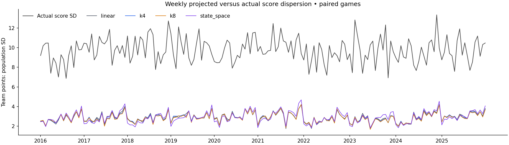
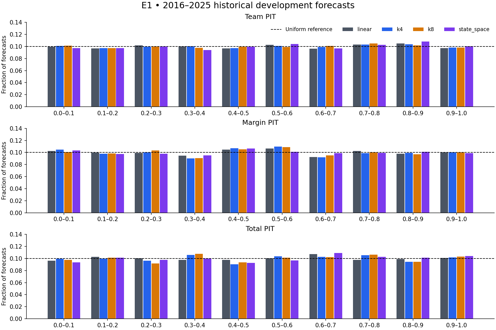

# E1 — Early-season updating rule

Decision: **NO_CHALLENGER_CLEARS_GATE**. Live method remains linear. No automatic promotion.

Preregistration: `a48e85241a47301ff3e462af70db6171c7c0edd750a67ac878ebe2b4411f1e62`; registered 2026-09-16T18:52:19.288870+00:00; first comparative result 2026-09-16T19:08:06.747285+00:00.
2639 paired regular-season games, 2016–2025. This is reused historical development evidence, not an untouched holdout.

## Gate table

| Candidate | Team MAE | Change vs control | Margin MAE | Total MAE | Margin 50 / 80 coverage | Total 50 / 80 coverage | Numeric gate |
|---|---:|---:|---:|---:|---|---|---|
| linear | 7.5716 | control | 10.2442 | 10.8757 | 50.28% / 79.54% | 50.66% / 80.07% | — |
| k4 | 7.5858 | -0.19% | 10.2535 | 10.9055 | 50.28% / 79.35% | 50.59% / 79.73% | FAIL |
| k8 | 7.6008 | -0.39% | 10.2647 | 10.9300 | 50.44% / 79.61% | 50.25% / 79.54% | FAIL |
| state_space | 7.5727 | -0.02% | 10.2469 | 10.8482 | 50.59% / 79.46% | 50.36% / 80.03% | FAIL |

Gate: at least 1% lower team MAE and all four margin/total coverage rates within 3 percentage points of nominal. Intervals and probabilities use each candidate’s own previous-three-season paired OOF residuals. No E2 post-processing was fitted.

## Paired uncertainty

| Candidate | 95% interval for control minus challenger team MAE |
|---|---|
| k4 | [-0.0235, -0.0050] |
| k8 | [-0.0439, -0.0140] |
| state_space | [-0.0204, 0.0189] |

2,000 fixed-seed resamples of four-week blocks within season. Both team errors remain together in each game. These are descriptive development intervals, not multiplicity-adjusted discovery claims.

## Annual team MAE

| Season | Linear | k4 | k8 | State space |
|---|---:|---:|---:|---:|
| 2016 | 7.1484 | 7.1478 | 7.1607 | 7.1543 |
| 2017 | 7.7996 | 7.8408 | 7.8623 | 7.8645 |
| 2018 | 7.8702 | 7.8505 | 7.8572 | 7.8087 |
| 2019 | 7.5204 | 7.5311 | 7.5513 | 7.5159 |
| 2020 | 7.5619 | 7.5572 | 7.5919 | 7.6218 |
| 2021 | 7.9826 | 8.0019 | 8.0144 | 7.9536 |
| 2022 | 7.2686 | 7.3112 | 7.3264 | 7.2267 |
| 2023 | 7.6194 | 7.6238 | 7.6347 | 7.6491 |
| 2024 | 7.3757 | 7.4065 | 7.4145 | 7.4037 |
| 2025 | 7.5700 | 7.5866 | 7.5943 | 7.5333 |

## Weeks 1–4

| Candidate | Team MAE | Margin MAE | Total MAE |
|---|---:|---:|---:|
| k4 | 7.5866 | 10.0467 | 11.2665 |
| k8 | 7.5830 | 10.0246 | 11.2822 |
| linear | 7.5934 | 10.0657 | 11.2433 |
| state_space | 7.5785 | 10.0159 | 11.2252 |

## Verification and compression

| Candidate | Target | Projected / actual SD | Skill vs league climatology | Skill vs persistence | CRPS |
|---|---|---|---:|---:|---:|
| k4 | team | 2.979 / 9.967 | 0.0856 | 0.1593 | 5.3635 |
| k4 | margin | 5.533 / 14.207 | 0.1425 | 0.1670 | 7.3503 |
| k4 | total | 2.211 / 13.873 | 0.0252 | 0.1519 | 7.7251 |
| k8 | team | 2.947 / 9.967 | 0.0822 | 0.1561 | 5.3792 |
| k8 | margin | 5.521 / 14.207 | 0.1407 | 0.1653 | 7.3577 |
| k8 | total | 2.061 / 13.873 | 0.0200 | 0.1473 | 7.7604 |
| linear | team | 3.002 / 9.967 | 0.0894 | 0.1627 | 5.3490 |
| linear | margin | 5.564 / 14.207 | 0.1448 | 0.1693 | 7.3422 |
| linear | total | 2.255 / 13.873 | 0.0305 | 0.1564 | 7.6916 |
| state_space | team | 2.985 / 9.967 | 0.0900 | 0.1632 | 5.3627 |
| state_space | margin | 5.615 / 14.207 | 0.1437 | 0.1682 | 7.3461 |
| state_space | total | 2.025 / 13.873 | 0.0329 | 0.1585 | 7.7239 |

Full weekly dispersion, skill versus league/last-season-team/persistence, PIT bin counts, interval scores and winner Brier/reliability are in `verification.json`. Forecast SD is audited beside actual SD, not forced to equal noisy realized-score dispersion.

## State fit parameters

| Fold | q | r | lambda | rho | P0 offense / defense diagonal | Half-life offense / defense | Riccati iterations / converged | Bound hits | Games / 3 optimized / 4 including rho |
|---|---:|---:|---:|---:|---|---|---|---|---|
| 2013 | 0.007278 | 0.846293 | 0.300000 | -0.038278 | 0.073118 / 0.073118 | 7.480 / 7.480 | 106 / True | none | 256 / 85.3 / 64.0 |
| 2014 | 0.006912 | 0.787451 | 0.700000 | 0.022184 | 0.068727 / 0.068727 | 7.413 / 7.413 | 104 / True | none | 512 / 170.7 / 128.0 |
| 2015 | 0.004799 | 0.841147 | 0.799533 | -0.008023 | 0.059727 / 0.059727 | 9.189 / 9.189 | 127 / True | none | 768 / 256.0 / 192.0 |
| 2016 | 0.004904 | 0.820566 | 0.548902 | 0.008995 | 0.059581 / 0.059581 | 8.981 / 8.981 | 124 / True | none | 1024 / 341.3 / 256.0 |
| 2017 | 0.004545 | 0.794612 | 0.519693 | 0.018852 | 0.056496 / 0.056496 | 9.180 / 9.180 | 126 / True | none | 1280 / 426.7 / 320.0 |
| 2018 | 0.004276 | 0.814964 | 0.464325 | 0.027801 | 0.055582 / 0.055582 | 9.584 / 9.584 | 131 / True | none | 1536 / 512.0 / 384.0 |
| 2019 | 0.004278 | 0.822091 | 0.488348 | 0.036761 | 0.055842 / 0.055842 | 9.623 / 9.623 | 132 / True | none | 1792 / 597.3 / 448.0 |
| 2020 | 0.004295 | 0.822823 | 0.531088 | 0.032333 | 0.055981 / 0.055981 | 9.608 / 9.608 | 132 / True | none | 2048 / 682.7 / 512.0 |
| 2021 | 0.004796 | 0.823868 | 0.520772 | 0.035673 | 0.059068 / 0.059068 | 9.099 / 9.099 | 126 / True | none | 2304 / 768.0 / 576.0 |
| 2022 | 0.004499 | 0.843928 | 0.540130 | 0.028991 | 0.058000 / 0.058000 | 9.508 / 9.508 | 131 / True | none | 2576 / 858.7 / 644.0 |
| 2023 | 0.004492 | 0.837971 | 0.516499 | 0.040789 | 0.057741 / 0.057741 | 9.480 / 9.480 | 131 / True | none | 2847 / 949.0 / 711.8 |
| 2024 | 0.004201 | 0.844617 | 0.543304 | 0.036308 | 0.056139 / 0.056139 | 9.842 / 9.842 | 135 / True | none | 3119 / 1039.7 / 779.8 |
| 2025 | 0.004439 | 0.842868 | 0.527372 | 0.034519 | 0.057590 / 0.057590 | 9.565 / 9.565 | 131 / True | none | 3391 / 1130.3 / 847.8 |
| 2026 | 0.004551 | 0.845778 | 0.531178 | 0.035107 | 0.058390 / 0.058390 | 9.463 / 9.463 | 130 / True | none | 3663 / 1221.0 / 915.8 |

The 2026 row is the current-season counterfactual fit, trained through 2025 only. Half-life is a steady-state approximation for an uninterrupted weekly reference schedule, not an empirical universal team-memory parameter. The filter optimizes three quantities and estimates rho from a fixed training-only pilot; 63 constrained latent states are also tracked. k4/k8 add no estimated parameters. All methods retain the existing four ridge coefficients including intercept; filter parameter counts are additional to those.

The 2013 and 2014 calibration-only training records contain no effective preseason transition after the mandated 2013 reset; lambda is not separately identified in those pilot fits. The optimizer coordinate is reported without claiming otherwise. Scored 2016–2025 folds have prior preseason transitions.

## Staff data addition and limitations

`config/staff_history.json` SHA-256: `a914b09d434d48371544054c26e38f14f9b1da61d9a05eb241688a02305a62a4`.

| Season | Team-seasons | HC | OC | DC | QB1 | Known QB1 changes |
|---|---:|---:|---:|---:|---:|---:|
| 2013 | 32 | 0 | 0 | 0 | 32 | 32 |
| 2014 | 32 | 0 | 0 | 0 | 32 | 32 |
| 2015 | 32 | 0 | 0 | 0 | 32 | 32 |
| 2016 | 32 | 0 | 0 | 0 | 32 | 32 |
| 2017 | 32 | 0 | 0 | 0 | 30 | 30 |
| 2018 | 32 | 0 | 0 | 0 | 32 | 30 |
| 2019 | 32 | 0 | 0 | 0 | 32 | 32 |
| 2020 | 32 | 0 | 0 | 0 | 32 | 32 |
| 2021 | 32 | 0 | 0 | 0 | 32 | 32 |
| 2022 | 32 | 0 | 0 | 0 | 32 | 32 |
| 2023 | 32 | 0 | 0 | 0 | 32 | 32 |
| 2024 | 32 | 0 | 0 | 0 | 32 | 32 |
| 2025 | 32 | 0 | 0 | 0 | 32 | 32 |
| 2026 | 32 | 0 | 0 | 0 | 32 | 32 |

PFR returned HTTP 403 for season/coaching-history probes. All 448 HC/OC/DC team-season records remain explicitly unknown, with source URLs and null retrieval timestamps; a successful coaching extraction is **not** claimed. MIA/TB 2017 did not have a Week 1 starter observation. Unknown combined coach/QB transitions use false, per A.3. `staff-coverage.json` enumerates every unknown team-season. No continuity weights, GM/roster fields, or PFF data were added to the model.

## Current-season issued-game comparison

AS_ISSUED baseline games; challenger forecasts are retrospective counterfactuals, not originally issued.

| Forecast | Games | Team MAE | Margin MAE | Total MAE |
|---|---:|---:|---:|---:|
| issued | 14 | 8.4277 | 11.6026 | 12.1067 |
| k4 | 14 | 8.6965 | 12.4181 | 11.8335 |
| k8 | 14 | 8.7366 | 12.4252 | 11.9295 |
| linear | 14 | 8.7087 | 12.4100 | 11.8673 |
| state_space | 14 | 8.8531 | 12.2416 | 12.1740 |

Only immutable AS_ISSUED contribution inputs are used for challenger counterfactuals. Original forecasts/grades are untouched. The two retrospective Week 1 games are excluded. All candidate fitting stops at 2025. Replay-linear follows the registered expanding-history refit and can differ from the originally issued version. Compare challengers with replay-linear to isolate the method comparison; originally issued scores remain a separate reference. Per-game before/after scores are in `current-season.json`.

## Governance and release

Phase A remains exploratory and does not count as E2. E2 is Week 3, separately registered against E1’s promoted method or the retained linear control. All registered challengers failed the numerical improvement gate; E1 is closed as rejected and linear is retained. Two reviewer responses have not been received; none is fabricated. No release approval is claimed. This experiment cannot activate a method.

Gate replay: 976.0 seconds, peak process RSS 322.7 MiB, one BLAS worker. Cached fits and OOF outputs are retained; this report renderer never refits.

Least certain: the nondiagonal reference covariance and team-specific preseason injection. Their exact reference equations and PSD scaling were recorded before results; invariance, convergence, and known-strength recovery were tested.
