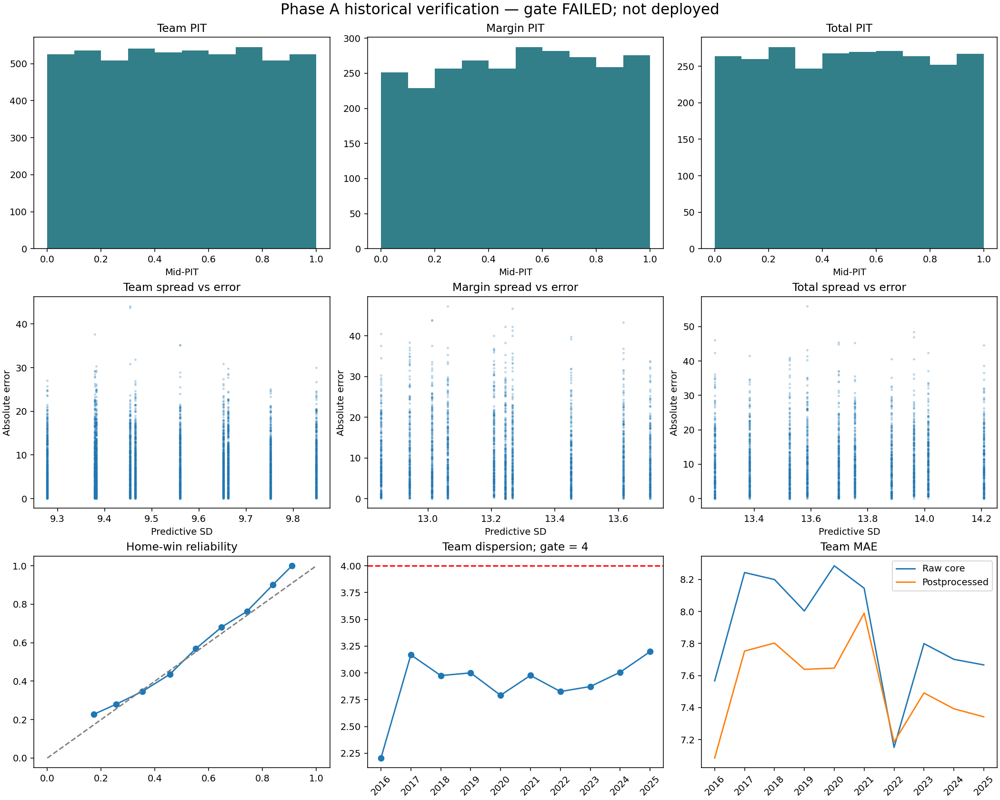

SERIES NOTICE: This report cites non-authoritative historical/replay series; only work/projection-v2w/deployed-oof-6a0238fcb08e5bfcf3a7daa6710e3c9cfb0f04b3c31dae77d3baa5f9b9956c10.json is authoritative for future gating. See the SERIES.md catalog.

# Forecast-system v2 — Phase A: FAILED; not promoted

The registered candidate improved average team-point accuracy but did not pass the dispersion and annual coverage gates. Phase B is not started. No production forecast, locked record, grade, schedule, or board was changed.

## Evidence and scope

2016–2025 regular seasons, 2,639 paired games. The canceled 2022 BUF–CIN game has no final result and is not scored. These are reconstructed historical forecasts, not proof of historical issuance. User-authorized 2013–2015 forecasts provide calibration only; 2011 warms inputs and 2012 starts ridge training. Each historical EMOS fit reads exactly the preceding three seasons. Ridge penalty selection uses earlier OOF results. No retuning was performed after the failed gate.

Core has 49 fitted coefficients; EMOS adds five identifiable parameters: a, b, c and two band contrasts. Middle-band offset is fixed at zero; all three bands are reported. No additional core calibration slope/intercept was added. Weather fitting awaits Phase D forecast provenance; unavailable historical roster/continuity/referee measurements remain inactive. This limitation prevents claiming every requested input is active in every historical game.

## Annual verification

| Season | Raw team MAE | EMOS team MAE | Team SD | Team skill | Margin skill | Total skill |
|---|---:|---:|---:|---:|---:|---:|
| 2016 | 7.566 | 7.085 | 2.206 | 0.105 | 0.169 | 0.032 |
| 2017 | 8.243 | 7.753 | 3.169 | 0.067 | 0.115 | 0.006 |
| 2018 | 8.200 | 7.803 | 2.975 | 0.083 | 0.129 | 0.032 |
| 2019 | 8.003 | 7.639 | 3.001 | 0.093 | 0.166 | 0.010 |
| 2020 | 8.285 | 7.646 | 2.791 | 0.109 | 0.182 | 0.048 |
| 2021 | 8.145 | 7.989 | 2.977 | 0.097 | 0.156 | 0.005 |
| 2022 | 7.151 | 7.185 | 2.826 | 0.065 | 0.068 | 0.047 |
| 2023 | 7.799 | 7.492 | 2.873 | 0.107 | 0.145 | 0.049 |
| 2024 | 7.701 | 7.393 | 3.007 | 0.092 | 0.190 | -0.053 |
| 2025 | 7.666 | 7.342 | 3.199 | 0.139 | 0.211 | 0.051 |

Skill = 1 − model MSE / prior-data league-climatology MSE. Positive means better. Dispersion is population SD of unrounded team-point projections; gate is at least 4.0. All ten seasons fail that gate. 2024 total skill is also negative under the registered all-target interpretation. Even a team-only skill interpretation would not rescue the dispersion failure.

## Coverage (50% / 80%)

| Season | Team | Margin | Total |
|---|---:|---:|---:|
| 2016 | 51.6% / 84.2% | 57.4% / 86.3% | 53.9% / 83.2% |
| 2017 | 48.6% / 78.7% | 50.4% / 78.5% | 47.7% / 75.8% |
| 2018 | 49.2% / 77.9% | 55.1% / 77.3% | 49.6% / 78.5% |
| 2019 | 49.6% / 76.8% | 48.0% / 76.6% | 50.4% / 78.1% |
| 2020 | 46.1% / 82.0% | 49.2% / 82.0% | 50.4% / 78.9% |
| 2021 | 45.4% / 80.9% | 47.8% / 75.0% | 45.6% / 79.8% |
| 2022 | 54.4% / 83.0% | 56.8% / 86.3% | 51.7% / 80.1% |
| 2023 | 51.7% / 79.2% | 52.6% / 77.2% | 49.6% / 83.5% |
| 2024 | 52.6% / 78.7% | 49.3% / 81.6% | 57.7% / 80.5% |
| 2025 | 51.1% / 79.6% | 48.2% / 79.0% | 46.0% / 77.9% |

## Pooled comparisons

| Target | Raw MAE | EMOS MAE | Climatology MAE | Last-season team MAE | Last-four MAE | Archived v1 MAE | CRPS |
|---|---:|---:|---:|---:|---:|---:|---:|
| margin | 10.153 | 10.168 | 11.134 | 10.986 | 11.351 | 10.170 | 7.337 |
| team | 7.871 | 7.531 | 7.965 | 8.119 | 8.268 | 7.566 | 5.343 |
| total | 11.649 | 10.842 | 11.001 | 11.711 | 11.869 | 10.938 | 7.688 |

Archived v1 forecasts are matched by row ID and checked against identical actual scores. Its historical weather-provenance limitations remain baseline evidence, not a shipping source for the new model.

Home-win Brier score: 0.2205. Event is home margin >0; ties are event false. Ten-bin reliability, all weekly/annual CRPS, PIT histograms, interval scores and widths are in verification.json. Per-game verification is in verified-games.json.

Spread in Phase A is residual predictive SD, not an input ensemble. Within a season it is constant, so within-week spread-skill correlations may be undefined. Undefined correlations are stored as null, never passed as positive. Phase C would replace this with member spread, but cannot begin after this failed gate.

## Postprocessor parameters and fitting sample sizes

| Season | a | b | c | <20 offset | 20–27 offset | >27 offset | Prior games | Games per EMOS parameter | Residual 10–90 band |
|---|---:|---:|---:|---:|---:|---:|---:|---:|---|
| 2016 | 9.822 | 0.656 | 0.987 | 0.132 | 0 | 1.382 | 768 | 153.6 | -12.09 to 13.65 |
| 2017 | 4.913 | 0.884 | 0.997 | 0.523 | 0 | 0.200 | 768 | 153.6 | -11.77 to 12.69 |
| 2018 | 6.045 | 0.847 | 0.997 | 0.340 | 0 | -0.742 | 768 | 153.6 | -12.09 to 11.96 |
| 2019 | 5.766 | 0.859 | 0.997 | 0.245 | 0 | -1.327 | 768 | 153.6 | -12.09 to 12.23 |
| 2020 | 8.173 | 0.748 | 0.998 | -0.481 | 0 | -0.000 | 768 | 153.6 | -12.20 to 12.98 |
| 2021 | 7.779 | 0.787 | 0.998 | -0.721 | 0 | -0.503 | 768 | 153.6 | -12.01 to 13.00 |
| 2022 | 7.555 | 0.788 | 1.000 | -0.890 | 0 | 1.094 | 784 | 156.8 | -12.13 to 12.57 |
| 2023 | 7.349 | 0.779 | 0.999 | -0.917 | 0 | 0.823 | 799 | 159.8 | -11.47 to 12.48 |
| 2024 | 9.141 | 0.680 | 1.000 | -1.504 | 0 | 3.025 | 815 | 163.0 | -11.31 to 12.43 |
| 2025 | 7.919 | 0.743 | 0.999 | -1.101 | 0 | 2.007 | 815 | 163.0 | -11.20 to 12.87 |

All-year inert rule: False. Half-life is not applicable before Phase B. Residual bands above are point residual quantiles, not fitted weather error bounds.

| Core fold | Training games | Core coefficients | Games per coefficient |
|---|---:|---:|---:|
| 2013 | 256 | 49 | 5.2 |
| 2014 | 512 | 49 | 10.4 |
| 2015 | 768 | 49 | 15.7 |
| 2016 | 1024 | 49 | 20.9 |
| 2017 | 1280 | 49 | 26.1 |
| 2018 | 1536 | 49 | 31.3 |
| 2019 | 1792 | 49 | 36.6 |
| 2020 | 2048 | 49 | 41.8 |
| 2021 | 2304 | 49 | 47.0 |
| 2022 | 2576 | 49 | 52.6 |
| 2023 | 2847 | 49 | 58.1 |
| 2024 | 3119 | 49 | 63.7 |
| 2025 | 3391 | 49 | 69.2 |

## Gate table

| Requirement | Season | Pass |
|---|---|---|
| positive climatology skill | 2016 | PASS |
| team projection SD >=4 | 2016 | FAIL |
| coverage within 3 percentage points | 2016 | FAIL |
| positive climatology skill | 2017 | PASS |
| team projection SD >=4 | 2017 | FAIL |
| coverage within 3 percentage points | 2017 | FAIL |
| positive climatology skill | 2018 | PASS |
| team projection SD >=4 | 2018 | FAIL |
| coverage within 3 percentage points | 2018 | FAIL |
| positive climatology skill | 2019 | PASS |
| team projection SD >=4 | 2019 | FAIL |
| coverage within 3 percentage points | 2019 | FAIL |
| positive climatology skill | 2020 | PASS |
| team projection SD >=4 | 2020 | FAIL |
| coverage within 3 percentage points | 2020 | FAIL |
| positive climatology skill | 2021 | PASS |
| team projection SD >=4 | 2021 | FAIL |
| coverage within 3 percentage points | 2021 | FAIL |
| positive climatology skill | 2022 | PASS |
| team projection SD >=4 | 2022 | FAIL |
| coverage within 3 percentage points | 2022 | FAIL |
| positive climatology skill | 2023 | PASS |
| team projection SD >=4 | 2023 | FAIL |
| coverage within 3 percentage points | 2023 | FAIL |
| positive climatology skill | 2024 | FAIL |
| team projection SD >=4 | 2024 | FAIL |
| coverage within 3 percentage points | 2024 | FAIL |
| positive climatology skill | 2025 | PASS |
| team projection SD >=4 | 2025 | FAIL |
| coverage within 3 percentage points | 2025 | FAIL |
| postprocessed team MAE improves raw core | pooled | PASS |
| one worker 4GiB 45minutes | pooled | PASS |

## Compute and validation

Single worker, one BLAS thread; gate 18.44 seconds; peak resident memory 227.8 MiB. This measurement covers the gate runner, not one-time raw-data preparation. macOS measured run; Linux runner additionally imposes a 4 GiB address-space limit. Reports consume cached artifacts and do not refit.

279 tests passed: 11 focused tests, 50 existing projection tests and 218 Week 1 regression tests. Synthetic compressed forecasts recover slope 1.5; loader requests only prior three seasons; core and postprocessor row reversal produce identical outputs. Hand-calculated CRPS, interval score, skill and Brier fixtures pass. Fit hash tampering, missing calibration years and nonchronological core records are rejected.

Operational weekly publication and new scheduler cadence are not activated: this candidate failed the offline gate. Phase A is not reported as fully delivered or deployed. Phases B–E remain closed.

Least sure: whether the compression hypothesis would be supported by CRPS fitting. I left b unrestricted, tested synthetic slope recovery, and retained the measured b values rather than forcing expansion to satisfy the dispersion gate.

